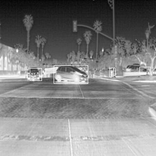

# Thermal Object Detection in Pytorch con una rete SSD Mobilenet V3 Large

## Requisiti
1. versione di torchvision 0.10.0
2. onnx 

## Riferimenti
1. [SSDlite](https://pytorch.org/vision/stable/models.html#id38), collegamento alla documentazione di pytorch del modello
2. [TORCHVISION OBJECT DETECTION FINETUNING TUTORIAL](https://pytorch.org/tutorials/intermediate/torchvision_tutorial.html?highlight=transfer%20learning), tutorial per il fine tuning da cui è stato preso spunto il codice del repositorio
3. [EXPORTING A MODEL FROM PYTORCH TO ONNX AND RUNNING IT USING ONNX RUNTIME](https://pytorch.org/tutorials/advanced/super_resolution_with_onnxruntime.html), per esportare il modello in ONNX
4. [Everything You Need To Know About Torchvision’s SSDlite Implementation](https://pytorch.org/blog/torchvision-ssdlite-implementation/), articolo che descrive i dettagli di implementazione del modello in Pytorch
5. [vision/references/detection/](https://github.com/pytorch/vision/tree/master/references/detection), repository da cui è stato ricavato il codice di supporto

## Contenuto
1. <code>reference/detection</code>, codice clonato dal repository di pytorch, con qualche modifica per adattarlo al progetto.
2. <code>recources/label_map.json</code>, contiene la mappatura degli identificatori delle categorie nel dataset agli indici usati nel codice.
3. <code>dataset_utils.py</code>, codice di supporto per gestire il dataset, come il conteggio delle categorie o degli esempi senza annotazioni.
4. <code>flir_dataset.py</code>, classe necessario per usufruire del dataset.

## Addestramento 
Per la configurazione del ciclo di addestramento ci si è basati sulle informazioni presenti sul blog di Pytorch [Everything You Need To Know About Torchvision’s SSDlite Implementation](https://pytorch.org/blog/torchvision-ssdlite-implementation/). Tra cui, la data augumentation ed il learning rate.
Per eseguiro l'addestramento basta avviare il comando
    
    python finetuning.py

al suo interno sono eseguiti anche la valutazione e l'esportazione del modello in formato ONNX.
Per eseguire dei test su campioni di immagini si può usare

    python inference.py

## Risultati
Come ci si aspettava, i risultati mostrano una precisione leggermente inferiore rispetto alla SSD Mobilenet V2. Infatti, la SSDLite contiene meno parametri 

I seguenti punteggi sono stati ottenuti con 100 epoche di addestramento.

|Metric|IoU|Area|maxDets|Score|
|------|---|----|-------|-----|
|Average Precision  (AP)|0.50:0.95|all|100|0.076|
|Average Precision  (AP)|0.50|all|100|0.173|
|Average Precision  (AP)|0.75|all|100|0.061|
|Average Precision  (AP)|0.50:0.95|small|100|0.007|
|Average Precision  (AP)|0.50:0.95|medium|100|0.095|
|Average Precision  (AP)|0.50:0.95|large|100|0.486|
|Average Recall     (AR)|0.50:0.95 |all|1|0.054|
|Average Recall     (AR)|0.50:0.95 |all|10|0.147|
|Average Recall     (AR)|0.50:0.95 |all|100|0.205
|Average Recall     (AR)|0.50:0.95 |small|100|0.099|
|Average Recall     (AR)|0.50:0.95 |medium|100|0.257|
|Average Recall     (AR)|0.50:0.95 |large|100|0.640|

